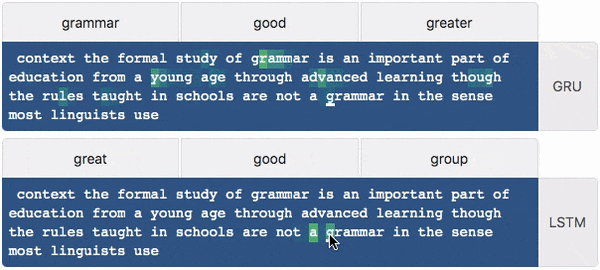
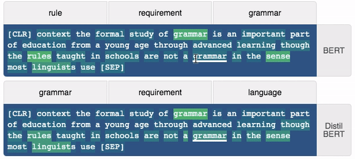
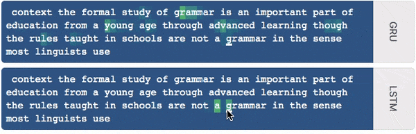
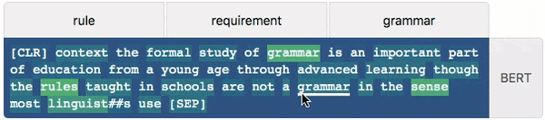

# textualheatmap

**Create interactive textual heatmaps for Jupiter notebooks.**

I originally published this visualization method in my distill paper
https://distill.pub/2019/memorization-in-rnns/. In this context, it is used
as a saliency map for showing which parts of a sentence are used to predict
the next word. However, the visualization method is more general-purpose than
that and can be used for any kind of textual heatmap purposes.

`textualheatmap` works with python 3.6 or newer and is distributed under the
MIT license.



An end-to-end example of how to use the
[HuggingFace 🤗 Transformers](https://github.com/huggingface/transformers) python
module to create a textual saliency map for how each masked token is predicted.

[](https://colab.research.google.com/github/AndreasMadsen/python-textualheatmap/blob/master/notebooks/huggingface_bert_example.ipynb)




## Install

```bash
pip install -U textualheatmap
```

## API

* [`textualheatmap.TextualHeatmap`](textualheatmap/textual_heatmap.py)

## Examples

### Example of sequential-charecter model with metadata visible

[](https://colab.research.google.com/github/AndreasMadsen/python-textualheatmap/blob/master/notebooks/general_example.ipynb)

```python
from textualheatmap import TextualHeatmap

data = [[
    # GRU data
    {"token":" ",
     "meta":["the","one","of"],
     "heat":[1,0,0,0,0,0,0,0,0]},
    {"token":"c",
     "meta":["can","called","century"],
     "heat":[1,0.22,0,0,0,0,0,0,0]},
    {"token":"o",
     "meta":["country","could","company"],
     "heat":[0.57,0.059,1,0,0,0,0,0,0]},
    {"token":"n",
     "meta":["control","considered","construction"],
     "heat":[1,0.20,0.11,0.84,0,0,0,0,0]},
    {"token":"t",
     "meta":["control","continued","continental"],
     "heat":[0.27,0.17,0.052,0.44,1,0,0,0,0]},
    {"token":"e",
     "meta":["context","content","contested"],
     "heat":[0.17,0.039,0.034,0.22,1,0.53,0,0,0]},
    {"token":"x",
     "meta":["context","contexts","contemporary"],
     "heat":[0.17,0.0044,0.021,0.17,1,0.90,0.48,0,0]},
    {"token":"t",
     "meta":["context","contexts","contentious"],
     "heat":[0.14,0.011,0.034,0.14,0.68,1,0.80,0.86,0]},
    {"token":" ",
     "meta":["of","and","the"],
     "heat":[0.014,0.0063,0.0044,0.011,0.034,0.10,0.32,0.28,1]},
    # ...
],[
    # LSTM data
    # ...
]]

heatmap = TextualHeatmap(
    width = 600,
    show_meta = True,
    facet_titles = ['GRU', 'LSTM']
)
# Set data and render plot, this can be called again to replace
# the data.
heatmap.set_data(data)
# Focus on the token with the given index. Especially useful when
# `interactive=False` is used in `TextualHeatmap`.
heatmap.highlight(159)
```


### Example of sequential-charecter model without metadata

[](https://colab.research.google.com/github/AndreasMadsen/python-textualheatmap/blob/master/notebooks/general_example.ipynb)

When `show_meta` is not `True`, the `meta` part of the `data` object has no effect.

```python
heatmap = TextualHeatmap(
    facet_titles = ['LSTM', 'GRU'],
    rotate_facet_titles = True
)
heatmap.set_data(data)
heatmap.highlight(159)
```



### Example of non-sequential-word model

[](https://colab.research.google.com/github/AndreasMadsen/python-textualheatmap/blob/master/notebooks/bert_hardcoded_example.ipynb)

`format = True` can be set in the `data` object to inducate tokens that are
not directly used by the model. This is useful if word or sub-word tokenization
is used.


```python
data = [[
{'token': '[CLR]',
 'meta': ['', '', ''],
 'heat': [1, 0, 0, 0, 0, ...]},
{'token': ' ',
 'format': True},
{'token': 'context',
 'meta': ['today', 'and', 'thus'],
 'heat': [0.13, 0.40, 0.23, 1.0, 0.56, ...]},
{'token': ' ',
 'format': True},
{'token': 'the',
 'meta': ['##ual', 'the', '##ually'],
 'heat': [0.11, 1.0, 0.34, 0.58, 0.59, ...]},
{'token': ' ',
 'format': True},
{'token': 'formal',
 'meta': ['formal', 'academic', 'systematic'],
 'heat': [0.13, 0.74, 0.26, 0.35, 1.0, ...]},
{'token': ' ',
 'format': True},
{'token': 'study',
 'meta': ['##ization', 'study', '##ity'],
 'heat': [0.09, 0.27, 0.19, 1.0, 0.26, ...]}
]]

heatmap = TextualHeatmap(facet_titles = ['BERT'], show_meta=True)
heatmap.set_data(data)
```



## Citation

If you use this in a publication, please cite my [Distill publication](https://distill.pub/2019/memorization-in-rnns/) where I first demonstrated this visualization method.

```bib
@article{madsen2019visualizing,
  author = {Madsen, Andreas},
  title = {Visualizing memorization in RNNs},
  journal = {Distill},
  year = {2019},
  note = {https://distill.pub/2019/memorization-in-rnns},
  doi = {10.23915/distill.00016}
}
```

## Sponsor

Sponsored by <a href="https://www.nearform.com/research/">NearForm Research</a>.
